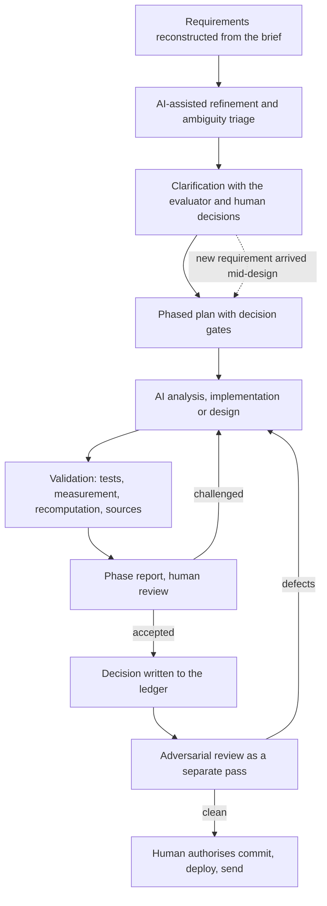

# AI-Assisted Engineering Workflow

## 1. Purpose

This assignment had two deliverables — a working demo with exact money handling, and a production design — in roughly 48 hours. AI was used because the analysis, implementation, verification and documentation involved exceeded what I could produce by hand in that time. This document explains how, so the process can be judged without reconstructing it from the repository.

AI did the analysis, wrote the code, tests and documentation, ran the research, and reviewed the work. Requirements, clarification with the evaluator, material engineering decisions, acceptance of each phase, and every commit, push, deployment and email remained mine.

The work was not one-shot. It ran as gated phases, each ending with a written report and stopping for my decision. Decisions were reopened when a test, a measurement, a review pass or new information — including a clarification that arrived mid-design — showed a gap. The process assumed AI output could be wrong, and it was, in ways recorded below.

## 2. Workflow at a glance



Not every session used every step: the final assessment of the demo was read-only by design, and the corrections from the design's adversarial pass were reviewed only by the AI that made them, not by me.

## 3. Roles

| Participant | Primary role | Examples |
|---|---|---|
| Me | Requirements, clarification, material decisions, acceptance, authorisation | Chose which questions went to the evaluator; chose per-currency reconciliation from options presented; set the phase-and-gate structure; authorised every commit and deployment |
| ChatGPT | Requirements refinement, ambiguity triage, prompt structuring, critique of Claude's output | Proposed clarification questions, several of which I removed as already answered; structured the phased prompts and escalation tiers |
| Claude Code | Analysis, implementation, tests, research, documentation, review, inside the repository | Wrote the engine, tests, decision ledger, CI and the production design; ran benchmarks and browser measurements; ran the adversarial passes |
| Read-only subagents | Bulk reading, primary-source verification, consistency sweeps | Nine verification tasks on Sonnet 5 returning exact quotes from standards, regulations and vendor documentation |

## 4. How the work was iterative

```text
AI proposes → I question → evidence: test, measurement, source → decision → revision → re-validation
```

**Clarification before code.** I reconstructed the assignment from the briefing and used ChatGPT to triage the ambiguities, removing questions already answered before sending. The evaluator confirmed local-currency display, a selectable budget currency and incremental percentage distribution. That the budget is *additional* money, not a target, I resolved and locked before implementation.

**A financial constant challenged.** I asked why the demo's budget cap was USD 1,729,943,778.01. The AI computed it (100× payroll), conceded the multiplier was arbitrary and offered to remove it. I kept it and required the reasoning written down: `demo/Design.md` D-23 now calls it a fat-finger guard, not a correct ceiling.

**A requirement that was missing.** The clarification that users should describe allocation in plain English arrived after four design phases; a search of both design files confirmed it was absent. The AI designed a natural-language layer; I rejected it as covering only the four examples given. A line-numbered coverage audit found ten missing components, which became a closed taxonomy of twelve intent classes, every clause landing in exactly one. I then questioned why autonomy was excluded; the result is a bounded loop where the model may interpret, simulate and compare, while publish, approve and commit stay human.

**Defects that survived generation.** After assembly, mechanical checks passed — 83 cross-references resolved, every diagram rendered. A separate adversarial read then found 18 defects: a worked example whose arithmetic did not reconcile, a ledger schema that was invalid PostgreSQL and broke the design's own tenancy rule, a yen headroom figure wrong by 100×.

**A correction that regressed.** One of those fixes made the commit transaction read an idempotency key the API had already stored, which would have short-circuited every job. It was caught on re-reading the API section and rewritten.

## 5. How AI output was validated

| Method | Used to validate | Example |
|---|---|---|
| Automated tests | Invariants, input policy, UI semantics, architecture | 114 tests asserting properties, not golden numbers; fitness tests for no float in the money path, no DOM in core, no dependencies |
| Continuous integration | The documented command, off this machine | Its first run caught `npm test` failing on Node 22, a version not installed locally |
| Mutation testing | That the suite fails when the code is wrong | Eight defects injected during the build, all caught. The mutants were not committed, so this is not reproducible from the repository |
| Fuzzing | The proven residual bound | 3,000 budgets across three currencies, zero violations, max 0.005273 against 0.005348 — which corrected a wrong figure in the documentation |
| Mathematical recomputation | The text's claims about its own numbers | The design's worked example recomputed by hand and found not to reconcile; the generalised weight formula shown algebraically to reproduce the demo to the minor unit |
| Browser measurement | What tests cannot see | Scripts driving Chrome: a 43-style contrast sweep, 17 below WCAG AA and then none; behaviour verified on the deployed site |
| Benchmarking | Every scaling claim in the design | Engine measured at 300 / 10k / 100k / 500k rows before any asynchronous architecture was proposed; a 400–800 B estimate overturned by measurement at 1,717 B |
| Primary-source verification | External facts a decision rests on | Exact quotes from EU Regulation 1103/97, ISO 4217, PostgreSQL, RFCs, privacy statutes and vendor documentation; two decisions changed as a result. Practitioner reports were kept apart and labelled secondary |
| Adversarial review | Whole-document consistency | Separate passes found 18, then 9, then 53 defects; two contradicted the design's own guarantees. Diagrams were rendered through a real renderer; scripted edits aborted unless the target matched exactly once |

Passing tests were treated as evidence, not proof. The suite was itself validated by mutation, and during the build the assertion was wrong more often than the code — a monotonicity check ignoring equal salaries, a non-breaking space compared against a space, a fixture assuming the lowest salary was also lowest in base currency. A failing test therefore triggered an investigation of which side was wrong, which is a written working rule in `CLAUDE.md`.

## 6. Examples of AI limitations

**The plain-English requirement.** Absent from the AI-written brief, which the AI had audited and amended fourteen times → found by the evaluator's clarification, not by the workflow → three design phases inserted → the headline feature exists because of an external check.

**The brief's own formula.** Weights were defined as salary × factors, which sums salaries across currencies → found by the AI in the next phase, reading the brief against the demo's rule never to convert per row → redefined as dimensionless exact rationals. Every mixed-currency rule would otherwise have been silently wrong.

**Assembly checks were not review.** The assembled design passed reference, table and diagram checks while containing an arithmetic error, an invalid schema and a stale estimate contradicting a later measurement → caught only by the separate adversarial pass.

**Subagents stated false facts.** One reported eight engine invariants (there are nine); one reported eighteen zero-decimal currencies (WST has two) → both caught by re-reading the primary source → text reverted. Subagent findings were treated as leads, not facts.

Still open: a read-only assessment of the frozen demo reported five findings, including a refusal message saying 92 employees "would round to nothing" when 64 would receive one cent. They are recorded and unchanged.

## 7. Human judgment and disagreement

**Do I agree with the designs in this submission?** I stand behind them — which is not the same as accepting whatever was proposed. The design is what survived being challenged, and the places where I hold it least confidently are written into it rather than smoothed over.

| Decision or proposal | AI position | My action | Outcome |
|---|---|---|---|
| Budget cap constant | Arbitrary; remove it | Kept it; required the reasoning documented | D-23 records both |
| Reconciliation semantics | Per-currency exact vs global, with trade-offs | Chose per-currency exact | D-05; residual bounded and reported, never forced to zero |
| Four production decisions (system of record, rule authoring, ledger scope, MVP) | Options with a recommendation each | Rejected the first framing as not understandable; decided after plain-language re-explanation | All four mine; recorded in `BRIEF.md` |
| Natural-language coverage | The layer was complete | Rejected four examples as "every case" | Audit found ten gaps; taxonomy added |
| Autonomy | Excluded | Asked whether that under-delivered "agentic" | Bounded orchestration added; money actions stay human |
| Model and cloud provider | The original vendor pair | Said the choice looked biased, and told the AI not to defer to my view either | Re-evaluated against the design's own requirements and changed; the evidence *against* the new choice is recorded as its reversal condition |
| Process notes in a submitted file | Edited `CLAUDE.md` for handoff after submission | Rejected | Reverted in full |
| Renaming `Design.md` | Showed the assignment names that file eight times, including in its own review checklist | Accepted the counter-evidence to my own suspicion | The unwritten design file was renamed instead |

AI recommendations were proposals: some accepted, some rejected, and some that reversed me with evidence.

Two decisions are recorded where the argument was not one-sided. D-23 keeps the budget cap while stating in the same entry that the multiplier is arbitrary and would not belong in a production engine. §21 picks one model provider and names the retirement cadence as "the one place the evidence favours the alternative", with the condition that would move the pin. A reader who disagrees with either has the reasoning and the reversal condition in front of them.

## 8. Model strategy — actual, not idealised

**Planned.** Strongest model for architecture, financial reasoning, test design and review; a cheaper one for implementation, UI and documentation. For the design: Fable 5 for research and drafting, Opus 5 for measurement review and the adversarial pass, Sonnet 5 for assembly.

**Actual.** The demo split was dropped early — re-establishing context and re-reviewing the cheaper model's output against the ledger cost more than it saved — so the demo ran on Opus 5 throughout. The design ran on Fable 5 (extended reasoning, plan mode) for Phases 0–5, including Phase 5, which had been planned for Opus 5 and was flagged before I approved it; assembly and adversarial review ran on Opus 5, not Sonnet.

What was genuinely specialised: ChatGPT as a critique layer outside the repository against Claude Code inside it; cheap read-only subagents for bulk reading and source verification; and plan mode, so every design phase was shown to me before any file was written.

## 9. Persistent context and phase gates

Each session started from written state, not a transcript:

- `CLAUDE.md` — locked requirements, architecture summary, phase status, decision tiers, working rules.
- `demo/Design.md` — 27 decisions, each with alternatives, cost and what would change it.
- `design/BRIEF.md` — scope, execution phases, and an amendment ledger recording why each earlier direction was reconsidered.
- Phase reports at every gate; nothing started without my instruction.

This stopped decisions being re-derived, let a new session or model continue mid-design, and made review possible: the audit that found two contradictions in the design's own guarantees worked by checking every demo decision against its text.

## 10. What I learned

- Requirements stay human-owned: the largest gap was found by the evaluator, not by any AI or test.
- Functional correctness is not production readiness; the brief required failure behaviour for every flow, because a passing happy path had proved insufficient in an earlier exercise.
- AI-written tests and documentation can both be wrong; both were checked against the code, not the reverse.
- Adversarial review catches a different class of defect from mechanical verification, and a correction needs the same scrutiny as the original. Subagent claims are leads; only the primary source settles them.
- New information can reopen an approved decision; the amendment ledger records why, not just what.

## 11. Final principle

AI produced most of the analysis, code, tests and documentation here. The workflow treated all of it as a proposal: tested, measured, checked against primary sources, read adversarially, then accepted, changed or rejected by me. Requirements, material engineering decisions and final acceptance were never delegated.

## Where the evidence lives

- `demo/Design.md` — the 27 demo decisions, including those argued over above.
- `demo/src/core/` and `demo/tests/` — the engine and the invariant, fitness and UI tests.
- `.github/workflows/test.yml` — the CI that caught the Node 22 failure.
- `design/BRIEF.md` — scope, execution phases and the amendment ledger.
- `design/PRODUCTION-DESIGN.md` — the production architecture; its Sources section lists what was verified.
- `CLAUDE.md` — the working rules and decision tiers the sessions ran under.
