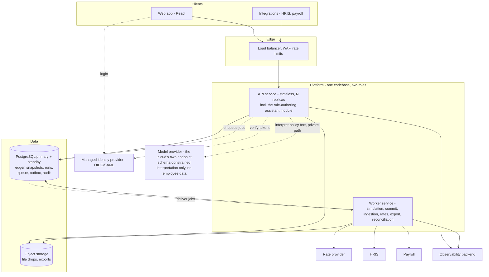

# Deliverable 2 — reader guide

**The deliverable is [`PRODUCTION-DESIGN.md`](PRODUCTION-DESIGN.md).** This page is a way into it:
what it argues, the ten decisions that shape it, and where to look when you want to challenge one.
Everything below links into the document rather than restating it.

`BRIEF.md` in this folder is the scoping brief the design was held to — the requirements, the
standard, and the amendments that followed measuring the demo's engine. `AI-WORKFLOW.md` records how
AI was used to produce both deliverables, how its output was validated, and where it was wrong. Both
are supporting material, not the deliverable.

---

## What this is

A production design for turning Deliverable 1's allocation engine into a multi-tenant
compensation-planning platform: the system a customer runs a real merit cycle through, from an HRIS
extract to money committed against a budget and exported to payroll.

Deliverable 1 — the working demo in [`../demo/`](../demo/) — is the starting point and the
specification of what must not change. Its engine survives as a versioned library; its
interface, in-memory dataset and static delivery do not.
[§1.5](PRODUCTION-DESIGN.md#15-what-carries-forward-from-deliverable-1) records, decision by
decision, what the demo contributed and what replaced it.

## In one paragraph

Money is an exact integer count of minor units and no binary floating-point value touches the
money path at any boundary — not in the database, the wire format, the logs or the rules layer.
Exchange rates are exact integer ratios in immutable, versioned sets pinned per cycle. Rounding
of paid money happens once per currency group per tranche per run, and the residue against the
entered budget is computed, bounded and recorded rather than lost. Every committed movement is a
double-entry journal in an append-only ledger whose balances are constrained projections, so a
pool cannot be over-committed and committed money is never edited — only reversed and reissued.
Customers describe how a budget should be shared in plain English; a language model compiles
that into a proposal in the platform's own rule catalogue, a deterministic compiler validates
and binds every number, a person confirms the platform's rendering, and from there a
deterministic engine executes with no model involved ever again. It runs as one codebase in two
roles over one PostgreSQL primary — no broker, no cache, no service mesh, no cluster — because
the measured workload does not justify them, and each exclusion carries the condition that would
reverse it.

## The system



Every platform component answers "why is this here?" and "what would remove it?" in
[§2](PRODUCTION-DESIGN.md#2-architecture-overview).

## Ten decisions

| | Decision | Where it is argued |
|---|---|---|
| 1 | **The employee's local-currency amount is authoritative.** Every base-currency figure is derived at read time and names the rate set it used, because a rate is a modelling assumption and storing one as a fact freezes it | [§4.1](PRODUCTION-DESIGN.md#41-authoritative-derived-stored-transmitted) |
| 2 | **Integer minor units end to end**, enforced at each boundary by a mechanism rather than an intention: fitness tests, a migration test, the wire schema, the driver's string defaults, the logger | [§4.2](PRODUCTION-DESIGN.md#42-representation-and-enforcement-at-every-boundary) |
| 3 | **One rounding of paid money**, once per currency group per tranche per run, half-up — with a complete inventory of every other rounding in the system and the argument for why the count is what it is | [§4.5](PRODUCTION-DESIGN.md#45-rounding) |
| 4 | **Per-currency reconciliation is exact; the residue is recorded, not lost.** It is an exact rational on the run record, bounded by half a minor unit per currency group per tranche, and independently derivable from the ledger — the two must agree, nightly | [§4.6](PRODUCTION-DESIGN.md#46-reconciliation) |
| 5 | **An append-only double-entry ledger for all committed monetary facts**, with balances as projections constrained in the same transaction. Immutability is a property of the database grants, not a convention in the code | [§4.7](PRODUCTION-DESIGN.md#47-the-ledger) |
| 6 | **A seam between rules and money.** Rules produce dimensionless exact rationals — weights, bounds, tranches; money turns those into paid amounts. Nothing a rule does can create, destroy, round or move money, and Deliverable 1 is the special case, reproduced to the minor unit | [§5.1](PRODUCTION-DESIGN.md#51-the-seam-restated-as-a-contract) |
| 7 | **Plain English becomes policy by proposal, not by execution.** The model proposes in the catalogue's own schema, a deterministic compiler validates and binds every number to the user's words or a versioned table, a person confirms the platform's rendering, and the engine executes | [§6](PRODUCTION-DESIGN.md#6-natural-language-rule-authoring) |
| 8 | **One database, one transaction for a commit.** Commit is a promotion of an approved result, not a computation: no engine run, no rate lookup, no external call inside the transaction that must be right | [§4.9](PRODUCTION-DESIGN.md#49-commit--the-money-side-transaction) |
| 9 | **The tenant boundary is held by the database**, not by application discipline: `tenant_id` in every key, row-level security forced on every table, an application role that owns nothing and cannot bypass it | [§10.4](PRODUCTION-DESIGN.md#104-multi-tenancy-as-a-security-property) |
| 10 | **Durable jobs with idempotency written inside the mutation's own transaction**, so a retry after any crash returns the original outcome rather than applying a second payroll commit | [§7](PRODUCTION-DESIGN.md#7-api-design), [§12](PRODUCTION-DESIGN.md#12-concurrency-and-consistency) |

And the decision that is a refusal: fifteen components considered and excluded — a streaming
platform, microservices, Kubernetes, a service mesh, a cache, a warehouse, active-active regions,
an autonomous agent over money — each with the condition that would justify reconsidering it
([§17](PRODUCTION-DESIGN.md#17-deliberately-excluded-components)).

## How the plain-English requirement works

```
A planner's sentence, in plain English
        ↓   the model reads English and proposes — it never sees employee data,
        ↓   never supplies a number, never executes
A structured proposal in the platform's rule catalogue
        ↓   a deterministic compiler validates: catalogue, number provenance,
        ↓   stage algebra, authorisation scope, coverage, lint, pre-flight
A validated policy, rendered back in plain English by the platform
        ↓   a person confirms the platform's rendering, not the model's prose
An immutable, content-hashed rule-set version
        ↓   deterministic rules engine → deterministic money engine
Simulation, per-employee explanation, approval on the result hash
        ↓
Commit — one transaction, one ledger journal
```

Reproducing a committed run years later re-enters at the rule-set version and never calls a
model. The diagram at the head of [§6](PRODUCTION-DESIGN.md#6-natural-language-rule-authoring)
draws this with the boundary marked;
[§6.1](PRODUCTION-DESIGN.md#61-the-principle-the-model-proposes-the-platform-decides-a-person-confirms-the-engine-executes)
states the six rules that enforce it, and
[§6.4](PRODUCTION-DESIGN.md#64-the-intent-taxonomy--every-statement-lands-somewhere-deterministic)
gives the closed taxonomy that makes "every statement lands somewhere deterministic" a finite,
testable claim rather than a hope.

## Where to read more

**In two minutes** — the opening of [`PRODUCTION-DESIGN.md`](PRODUCTION-DESIGN.md), the decision and
diagram in [§2](PRODUCTION-DESIGN.md#2-architecture-overview), the diagram at the head of
[§6](PRODUCTION-DESIGN.md#6-natural-language-rule-authoring), and the first column of
[§17](PRODUCTION-DESIGN.md#17-deliberately-excluded-components).

**In ten minutes** — add [§1](PRODUCTION-DESIGN.md#1-requirements-and-assumptions) (the requirements
and the eleven load-bearing assumptions, each with what changes if it is wrong) and the six
guarantee tables that close [§4](PRODUCTION-DESIGN.md#4-money-architecture),
[§5](PRODUCTION-DESIGN.md#5-allocation-engine-and-rules),
[§6](PRODUCTION-DESIGN.md#6-natural-language-rule-authoring),
[§12](PRODUCTION-DESIGN.md#12-concurrency-and-consistency),
[§16](PRODUCTION-DESIGN.md#16-delivery) and [§19](PRODUCTION-DESIGN.md#19-cost): forty-eight
numbered guarantees, each naming the mechanism that enforces it.

**When challenging a decision** — every significant component states its problem, the options
weighed, the choice, the consequences and what would change it. The sections that carry the most
weight: money ([§4](PRODUCTION-DESIGN.md#4-money-architecture)), the rules engine and its
λ-search ([§5](PRODUCTION-DESIGN.md#5-allocation-engine-and-rules)), failure behaviour per flow
([§4.12](PRODUCTION-DESIGN.md#412-failure-behaviour-of-the-money-flows),
[§5.10](PRODUCTION-DESIGN.md#510-failure-behaviour),
[§6.9](PRODUCTION-DESIGN.md#69-failure-behaviour),
[§8](PRODUCTION-DESIGN.md#8-employee-data-ingestion),
[§13](PRODUCTION-DESIGN.md#13-reliability)), the threat model with its "enforced where" column
([§10.2](PRODUCTION-DESIGN.md#102-the-threat-model)), the measurements the architecture rests on
([§18.2](PRODUCTION-DESIGN.md#182-what-was-measured)), and the roadmap's exit criteria, which
are written so they can come back negative ([§23](PRODUCTION-DESIGN.md#23-build-roadmap)).

## Assumptions that shape the architecture

Five of the eleven load-bearing assumptions decide the shape of the system. Each is stated in
[§1.3](PRODUCTION-DESIGN.md#13-assumptions) with what rests on it and what would
have to change if it were wrong.

- **This platform is the planning layer; the HRIS remains the system of record.** Commit is one
  local transaction and export is eventual but observable. If it were wrong, commit would become a
  cross-system saga with a third party's availability inside it.
- **A budget is additional money, not a target payroll total.** The whole allocation formulation
  rests on it — the ratio solved for, the feasibility range, the reconciliation invariant.
- **A cycle plans at one pinned set of exchange rates.** This is what makes a rate-provider outage
  harmless, reproduction possible, and one rounding per currency group per tranche sufficient.
- **A person confirms every policy and approves every result; nothing autonomous moves money.**
  This is the boundary the whole plain-English layer is built around.
- **Everything one commit touches lives in one database.** One transaction covers a commit and
  there is no distributed coordination anywhere; capacity alone does not threaten this, because a
  tenant too large for the shared primary moves to its own database and keeps the model.

## Numbers and sources

Every quantitative claim in the document is measured, quoted from the documentation of the thing
it describes, or explicitly labelled an estimate or a planning assumption. Every quotation from
an external document — a regulation, a standard, a manual — is taken from the primary text (a short
list of practitioner reports is kept apart, labelled secondary, and never quoted), and
[Sources](PRODUCTION-DESIGN.md#sources) lists each one with the section that cites it, so a
claim resting on someone else's document can be checked against that document. The engine was
measured at 300, 10,000, 100,000 and 500,000 employees; those measurements — not intuition —
decide where work becomes asynchronous, how workers are sized, and what the storage lever is
([§18.2](PRODUCTION-DESIGN.md#182-what-was-measured)). Where a figure could not be measured, the
roadmap names the stage that replaces it with one
([§23](PRODUCTION-DESIGN.md#23-build-roadmap)).
